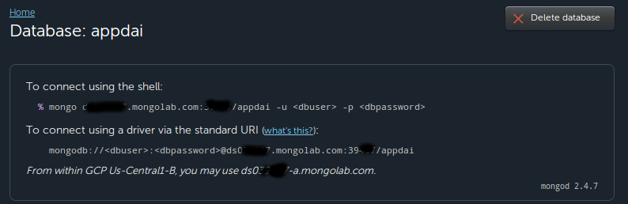
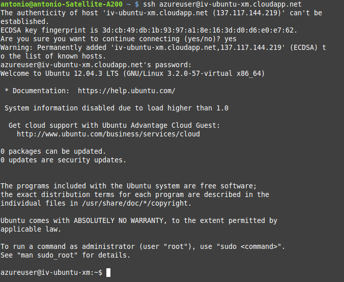

Práctica 3 de IV
==================

Práctica 3 de la asignatura IV: creación de máquinas virtuales.

## Introducción

El objetivo de esta práctica es crear máquinas virtuales con un propósito específico, en mi caso correr una aplicación web, de forma que se asignen los recursos a las mismas de la forma más eficiente posible. Para ello crearé varias máquinas virtuales (de aquí en adelante MV) en Windows Azure con diferentes configuraciones y ejecutaré sobre las mismas una batería de peticiones usando el software [Apache Benchmark](http://httpd.apache.org/docs/2.2/programs/ab.html).

## La aplicación

La aplicación que voy a ejecutar sobre las máquinas virtuales es la creada para la asignatura DAI, la cual se puede descargar desde [éste repositorio](https://github.com/antonioguirola/appdai-public), sólo es necesario establecer los parámetros de conexión a la base de datos.

Como nos encontramos en un entorno de pruebas voy a usar el servidor web integrado en el propio framework.

### Base de datos

Voy a utilizar una base de datos común para todas las instacias de la aplicación, para ello, como la aplicación está preparada para usar MongoDB, he creado una base de datos en la nube usando [MongoLab](www.mongolab.com) a la cual se conectarán las instancias:


Los parámetros para la conexión que tendremos que introducir en el código los podemos consultar haciendo click sobre la base de datos:



### Despliegue de la aplicación en las MV

Para agilizar el despliegue de la aplicación en las distintas MV realizaré la instalación desde un repositorio privado en [bitbucket](www.bitbucket.org) en el cual se encuentra la aplicación con todas las opciones de configuración ya establecidas.

Para solventar las dependencias de Python voy a usar un [script](generateEnvironment.sh) que genere un entorno virtual en el cual se instalen las dependencias necesarias:

```sh
#!/bin/bash

# Instalación de los paquetes necesarios
sudo apt-get install -y python-virtualenv
sudo apt-get install -y git
sudo apt-get install -y python-dev
sudo apt-get install -y libxml2-dev libxslt-dev

# Variable de entorno necesaria para twitter
export LC_ALL=C

# Creación del entorno virtual Python
cd ~
mkdir env
cd env
virtualenv --distribute env1
cd env1/
source bin/activate

# Instalación de los paquetes Python necesarios
# dentro del entorno virtual
pip install web.py
pip install mako
pip install pymongo
pip install lxml
pip install tweepy

# Recuperamos la aplicación del repositorio privado
git clone https://antonioguirola@bitbucket.org/antonioguirola/appdai.git
cd appdai

# Ejecutamos el servidor web de web.py
python code.py
```

## Creación de las máquinas virtuales

### Máquina 1: Ubuntu Server 12.04 LTS extra pequeño

Pulsamos en nueva MV y seleccionamos elegir desde imagen, a continuación seleccionamos la imagen de Ubuntu Server 12.04:


El siguiente paso esponerle nombre a la MV, el tamaño de la máquina virtual y fijar el password del usuario que vamos a utilizar, por defecto *azureuser*:


Para esta primera MV he seleccionado tamaño extra pequeño, el cual proporciona un núcleo compartido y 768 MB de memoria RAM.

En el siguiente paso elegimos la localización del servidor (Europa preferiblemente) y la cuenta de almacenamiento que ya hemos creado en los [ejercicios 8 y 9 del tema 4](https://github.com/antonioguirola/IV2013/blob/master/Ejercicios/EjerciciosAlmacenamiento.md):


En el último paso se seleccionan los puertos que necesitemos para los servicios de nuestra MV, que son:

* 22 para acceso SSH
* 39487 para conexión con la base de datos en MongoLab
* 8080 para ejecutar el servidor web incorporado en web.py


#### Conexión a la MV

Una vez arrancada la MV podemos enviar el script con `scp generateEnvironment.sh azureuser@iv-ubuntu-mx.cloudapp.net` y a continuación acceder por SSH mediante la orden:



Una vez en la MV, ejecutamos el script y comprobamos que la aplicación efectivamente funciona:


El siguiente paso es ejecutar el script con Apache Benchmark que se mostrará más adelante, he decidido lanzarlo sobre la sección de la aplicación que muestra un mapa de Google, la localización de la ETSIIT y la de nuestro ordenador si damos permiso:


### Máquina 2: Ubuntu Server 12.04 LTS pequeño

Para esta configuración en vez de crear una nueva máquina voy a apagar la primera MV, cambiar su configuración y volver a encenderla, para ello vamos a la pestaña *Panel* de la MV en la web de Azure y pulsamos en apagar:


A continuación vamos a la pestaña *Configurar*, cambiamos el tamaño de la máquina a *Pequeño* y pulsamos en *Guardar*:


Con los cambios aplicados ya podemos volver a arrancar la máquina y ejecutar las pruebas sobre ella.


### Máquina 3: Ubuntu Server 13.10 extra pequeño

Para las configuraciones 3 y 4 he elegido el último sistema disponible de la plataforma Ubuntu con el objetivo de comprobar si se han introducido mejoras en la eficiencia de la distribución. Para crearla, tal y como hicimos con la máquina 1 tendremos que seleccionar la imagen correspondiente en el menú de nueva máquina virtual:


En esta ocasión el nombre elegido es *iv-ubuntu-1310* y al igual que con la máquina 1 el tamaño elegido es extra pequeño:


Como estoy utilizando un servicio DBaaS hay que utilizar el mismo puerto para la conexión con la base de datos:


Una vez finalizada la configuración y cuando observemos en el panel de control que la máquina ya está iniciada podremos enviarle el script de instalación y conectarnos a ella mediante SSH para iniciar la aplicación y así poder realizar las pruebas:


#### Problema

Mientras el script descargaba e instalaba el módulo Python lxml obtuve el siguiente error:


Pero instalando tal y como se dice [aquí](http://stackoverflow.com/questions/3373995/usr-bin-ld-cannot-find-lz) el paquete *sudo apt-get install lib32z1-dev*, borrando el directorio y volviendo a ejecutar el script el problema se solucionó.


### Máquina 4: Ubuntu Server 13.10 pequeño

Para configurar la MV 4 los pasos son exactamente los mismos que con la 2: apagar, cambiar el tamaño de la MV, volver a encender y realizar las pruebas.

## Benchmark

Como se ha dicho en la introducción voy a utilizar Apache Benchmark para establecer que configuración es la más apropiada para la aplicación web, para ello el primer paso es instalar `sudo apt-get install apache2-utils` en la máquina desde la que se van a lanzar las peticiones.

### Carga de trabajo

Haciendo las pruebas iniciales he comprobado que si hacemos un número elevado de peticiones a la MV o muchas concurrentes Azure corta la conexión y no permite que se termine de ejecutar el benchmark:


Por lo tanto he asignado las dos siguientes cargas de trabajo, que son las más altas que he encontrado permitiendo finalizar las pruebas:

* 1900 peticiones con una concurrencia de 100 simultáneas
* 2500 peticiones sin concurrencia

### Métricas

Los parámetros que he elegido para comparar las siguientes configuraciones son:

* Tiempo necesario para el test, en segundos
* Tasa de transferencia, en KBytes/s recibidos

### Script

He creado el siguiente script, que recibe la URL a probar como argumento, para que realice las pruebas seleccionadas y muestre los resultados de las 5 repeticiones por pantalla:

```sh
#!/usr/bin/python
# -*- coding: utf-8 -*- 

# Uso: python benchmark.py <URL>

import sys
import os

#Cogemos la URL del primer argumento:
url=sys.argv[1]

tiempos = []
tasas = []
repeticiones = 5

# Ejecutamos los test sin concurrencia:
for x in xrange(0,repeticiones):
	os.system("ab -c 1 -n 2500 "+url+" >> resSinConcurrencia")

resultados = file("resSinConcurrencia")
for line in resultados:
    array=line.split(" ")	#generamos una lista con las palabras de la línea
    if array[0]=="Time" and array[1]=="taken":	#buscamos las líneas que indican el tiempo
    	tiempos.append(array[6]) 	#añadimos el resultado, que está en la posición 6
    if array[0]=="Transfer" and array[1]=="rate:":	#buscamos las líneas que indican la tasa de transferencia
    	tasas.append(array[11]) 	#añadimos el resultado, que está en la posición 11
    

# Mostramos los resultados:
print("-------------- Resultados del test sin concurrencia --------------")
print("Tiempos, en segundos:")
for x in xrange(0,repeticiones):
	print("Repetición "+str(x)+" : "+tiempos[x])

print("Tasas de transferencia, en KB/s:")
for x in xrange(0,repeticiones):
	print("Repetición "+str(x)+" : "+tasas[x])

os.system("rm resSinConcurrencia")

# Ejecutamos los test con concurrencia:
for x in xrange(0,repeticiones):
	os.system("ab -c 100 -n 1900 "+url+" >> resConConcurrencia")

resultados = file("resConConcurrencia")
for line in resultados:
    array=line.split(" ")	#generamos una lista con las palabras de la línea
    if array[0]=="Time" and array[1]=="taken":	#buscamos las líneas que indican el tiempo
    	tiempos.append(array[6]) 	#añadimos el resultado, que está en la posición 6
    if array[0]=="Transfer" and array[1]=="rate:":	#buscamos las líneas que indican la tasa de transferencia
    	tasas.append(array[11]) 	#añadimos el resultado, que está en la posición 11
    

# Mostramos los resultados:
print("-------------- Resultados del test con concurrencia --------------")
print("Tiempos, en segundos:")
for x in xrange(0,repeticiones):
	print("Repetición "+str(x)+" : "+tiempos[x])

print("Tasas de transferencia, en KB/s:")
for x in xrange(0,repeticiones):
	print("Repetición "+str(x)+" : "+tasas[x])

os.system("rm resConConcurrencia")
```

Tras ejecutar el script contra la primera MV por ejemplo con la orden `python benchmark.py http://iv-ubuntu-xm.cloudapp.net:8080/maps` obtenemos la siguiente salida:


## Resultados

Tras ejecutar el script contra las 4 configuraciones estos son los resultados obtenidos (en media):


|					MV					|		Tiempo (s)		|		Tasa de transferencia (KB/s)		|
|:-------------------------------------:|:---------------------:|:-----------------------------------------:|
| Ubuntu Server 12.04 LTS - Extra peq.	|366.25					|39.2										|
| Ubuntu Server 12.04 LTS - Pequeño		|356.83					|40.26										|
| Ubuntu Server 13.10 - Extra peq.		|360.63					|39.85										|
| Ubuntu Server 13.10 - Pequeño			|351.37					|40.88										|


Se adjunta en el proyecto el documento de OpenOffice con los resultados pormenorizados.

## Conclusiones

Como se puede apreciar de los resultados la versión 13.10 es más eficiente que la 12.04, aunque esta mejoría es más notable en el tiempo necesario para procesar las peticiones que en la tasa de transferencia que puede emitir el servidor, presumiblemente debido al cuello de botella en la interfaz de red.

## Observaciones

Me he dado cuenta de que tras dejar toda la noche funcionando la MV con la aplicación ejecutándose no pude volver a conectarme a la mañana siguiente sin reiniciar el servidor web, por lo tanto deduzco que, al tratarse de un servidor web orientado principalmente al testeo de aplicaciones web, éste se cierre después de un periodo de inactividad.
